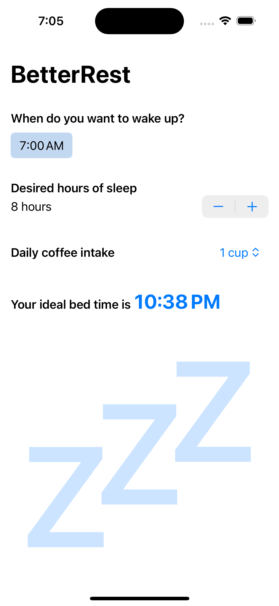
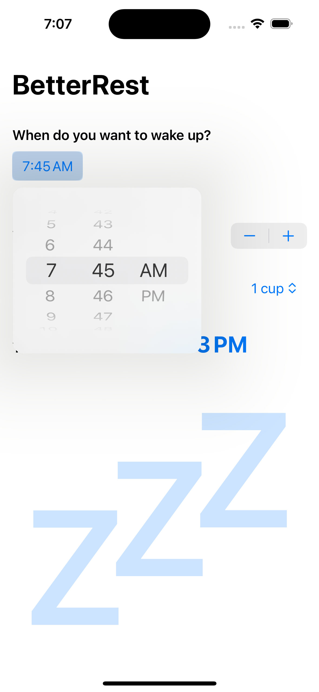
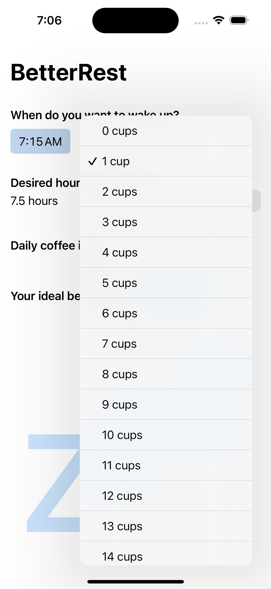
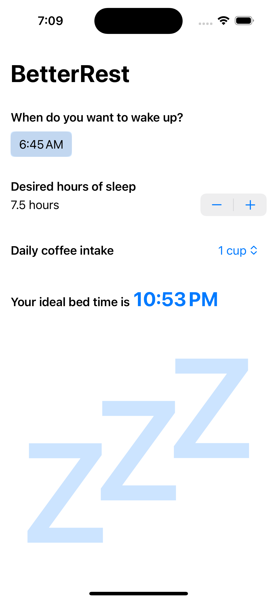
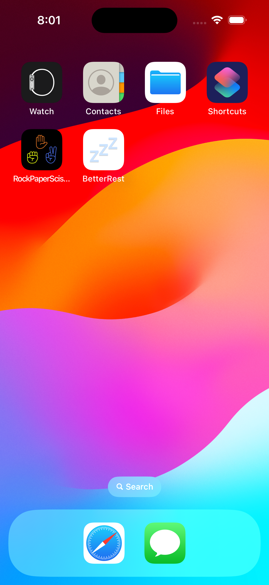

# Day 26-28: Project 4 - BetterRest

BetterRest is the 4th project in my [100 Days of SwiftUI](https://www.hackingwithswift.com/100/swiftui) journey. BetterRest is an iOS app helping the user find out the ideal time to go to bed based on their desired time to wake up, their desired amount of sleep at night, as well as their coffee intake during the day. Under the hood, the app uses a machine learning model, trained on the dataset given in the project instruction, to predict the actual amount of sleep per night based on the described attributes, then computing the ideal bedtime. This is the first project that has machine learning integrated. Thanks to [Apple's CoreML framework](https://developer.apple.com/machine-learning/core-ml/) which does most of the comprehensive algorithms and cool stuff behind the scene, it turns out incorporating some machine learning work in a project is not as scary as I had thought. The framework surely has so many functionalities to offer and leaves so much room to explore after this project. 

## App current states
- The user is able to input their desired wake up time, desired amount of sleep at night and daily coffee intake (in cup(s)). The app will then dynamically compute the ideal bedtime as the inputs are updated accordingly.

## Future improvements
- Currently, BetterRest uses tabular regression to figure out the relationships among the attributes in the dataset in order to predict the actual amount of sleep that a person needs (based on the data in the trained dataset). The prediction error is roughly 180 seconds, or 3 minutes. While this is not at all a terrible prediction, other algorithms are worth investigating to improve the accuracy.
- The dataset is open source and may not be completely relatable to some certain users. As a user, I find the data...pretty sketchy (🙈). A more meaningful dataset that should be used to train the model could be the user's personal sleep tracking data from their iOS devices. A future feature for BetterRest could be to import user data from those devices natively in the app to train the model before making predictions. This would be a cool feature, but before tempting to implement it, I should probably be learning more about machine learning in general to understand how it works behind the scenes, and also to understand the security and privacy implications of this feature, as well as its technical constraints and feasibility.

## A glimpse of BetterRest
<table>
  <tr>
    <td>The start screen with assumptions about a user's daily routine: wakes up at 7AM, sleeps 8 hours every night, and drinks 1 cup of coffee every day</td>
    <td>The date picker allowing the user to choose their desired wake up time. Of course the app is inclusive of people who might work night shifts and sleep during the daytime.</td>
    <td>The user can also adjust their coffee intake, anywhere from 0 cups to 20 cups per day (20 is likely enough for anyone...right?)</td>
  </tr>
  <tr>
    <td></td>
    <td></td>
    <td></td>
  </tr>
  <tr>
    <td>The ideal bedtime is dynamically computed and updated as the inputs change</td>
    <td>BetterRest's 3-minute app icon designed by me ✨</td>
    <td>How BetterRest looks on an iPhone home screen</td>
  </tr>
  <tr>
    <td></td>
    <td></td>
    <td></td>
  </tr>
 </table>
