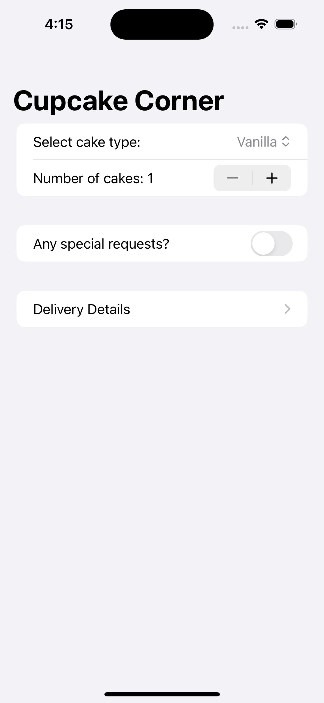
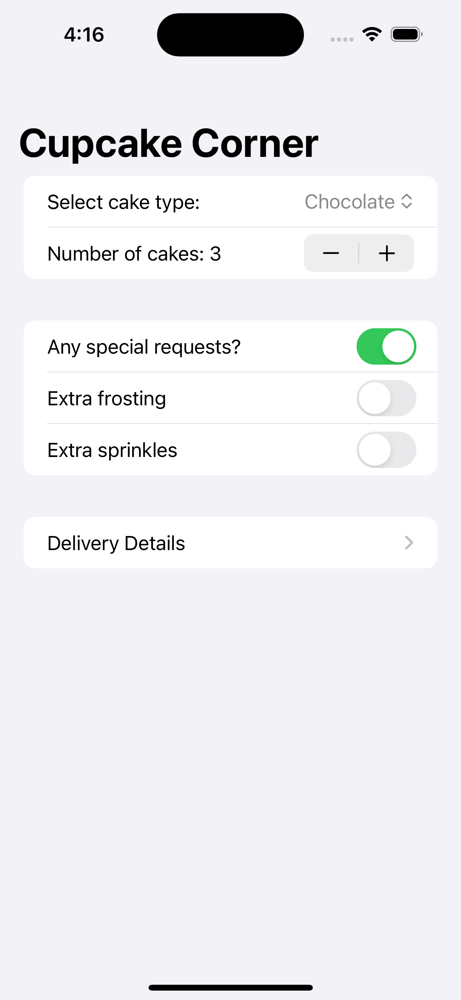
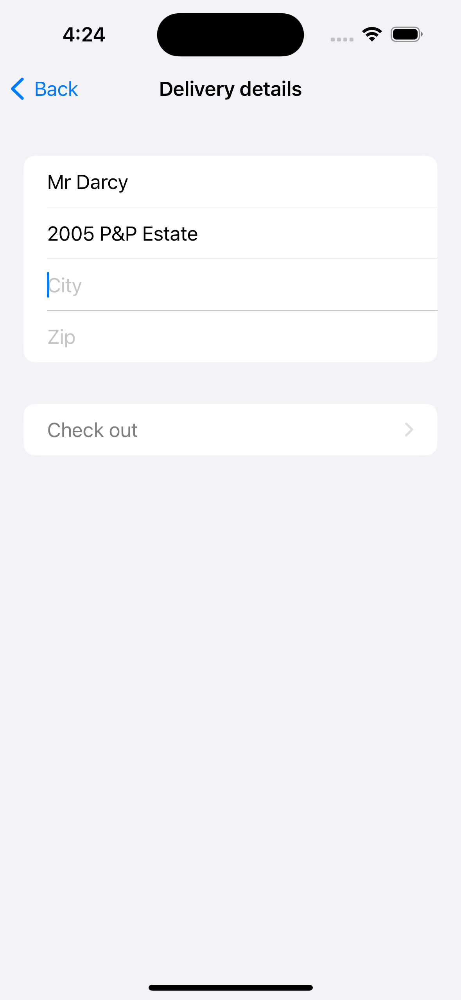
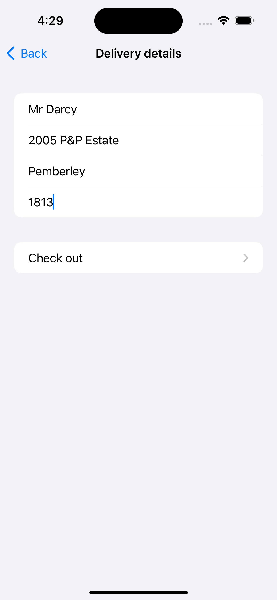
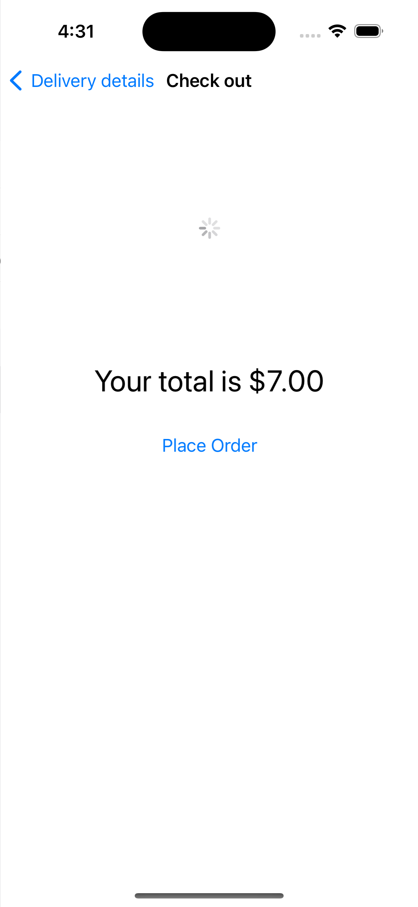
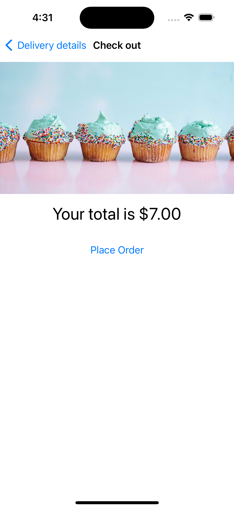
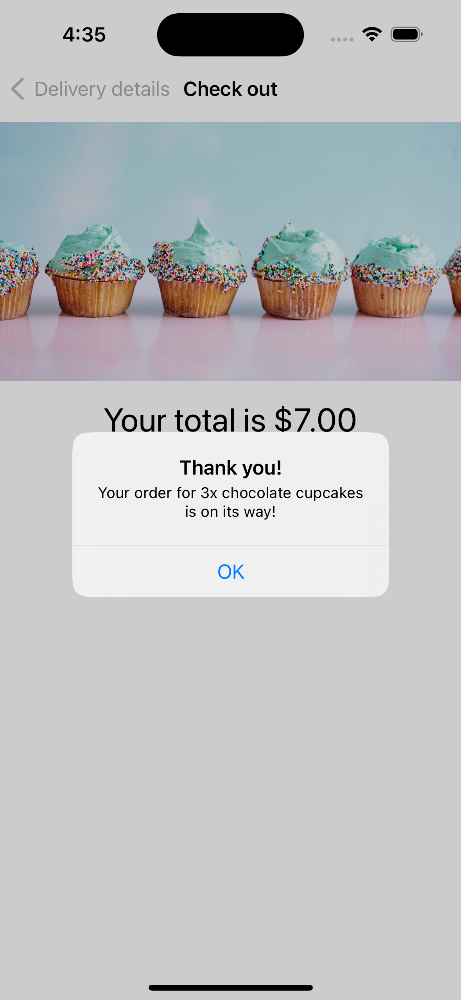
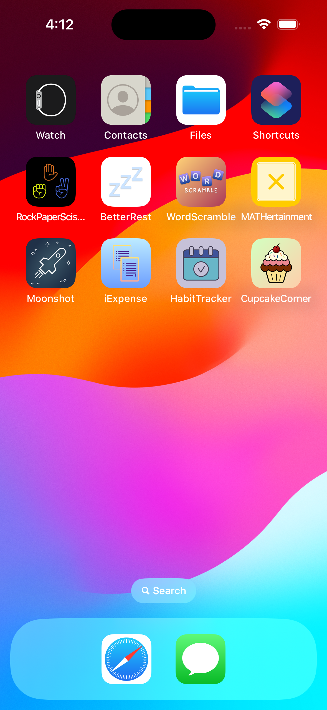

# Day 49-52: Project 10 - CupcakeCorner 🧁

CupcakeCorner is the 10th project in the [100 Days of SwiftUI](https://www.hackingwithswift.com/100/swiftui) journey, yet the 1st project where we go deep into data and networking with SwiftUI. Coming from the web development background, I think it is true that SwiftUI does facilitate networking communication, specifically the process of sending requests to the server and handling the responses, thanks to the handy tools such as `URLRequest` and `URLSession`, along with  `Codable`, `JSONEncoder()` and `JSONDecoder()`, which all streamline data formatting and serializing. It is unquestionably beyond doubt that knowing how to implement data communication over the network indeed opens a lot of possibilities for more interesting and meaningful project ideas, and I can’t wait to discover more.

## App current states
- The user is able to personalize a cupcake order catering to their preferences, specifying the cupcake type and quantity, as well as customizing the choice of frosting and sprinkles.
- The user is able to enter their address for delivery details. This information is saved in the app to streamline future orders.
- The user is able to “place the order”, which means, in technical terms, to send a request to the server with all information about the order and get some confirmation back containing the request status. Currently, for the purpose of learning, the request is sent to `https://reqres.in/api/cupcake` which will echo back a response with whatever previously sent in the request to the server.

## Future improvements
- At the moment, CupcakeCorner is a toy application that serves the purpose of learning about how to handle data communication and networking in SwiftUI. There are a lot of rooms for improvements, features-wise, technical implementation-wise, and UX-wise. Fancy features aside, from what the app is able to offer now and based on the data the app already collects from the users, I think it would be nice if CupcakeCorner can show the list of order history with all the order details, increasing the visibility of past orders to the users.

  
## A glimpse of CupcakeCorner
<table>
  <tr>
    <td>CupcakeCorner start screen</td>
    <td>Customizing the order details with special requests</td>
    <td>Enter address for delivery: when some address info is missing, the checkout button is disabled.</td>
  </tr>
  <tr>
    <td></td>
    <td></td>
    <td></td>
  </tr>
  <tr>
    <td>The checkout button becomes enabled when the address info is filled.</td>
    <td>A loading indicator is shown when some data (an `AsyncImage`) is loading.</td>
    <td>The order screen where the user can place the order.</td>
  </tr>
  <tr>
    <td></td>
    <td></td>
    <td></td>
  </tr>
  <tr>
    <td>A friendly confirmation message that the order has been placed successfully.</td>
    <td>CupcakeCorner app icon designed by me, yummy ✨</td>
    <td>How CupcakeCorner app looks on iPhone home screen</td>
  </tr>
  <tr>
    <td></td>
    <td></td>
    <td></td>
  </tr>
 </table>
