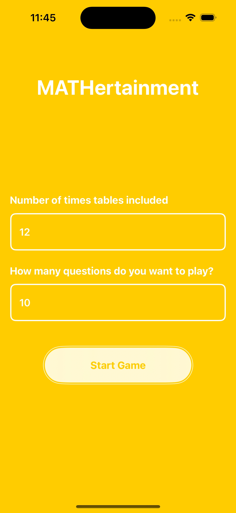
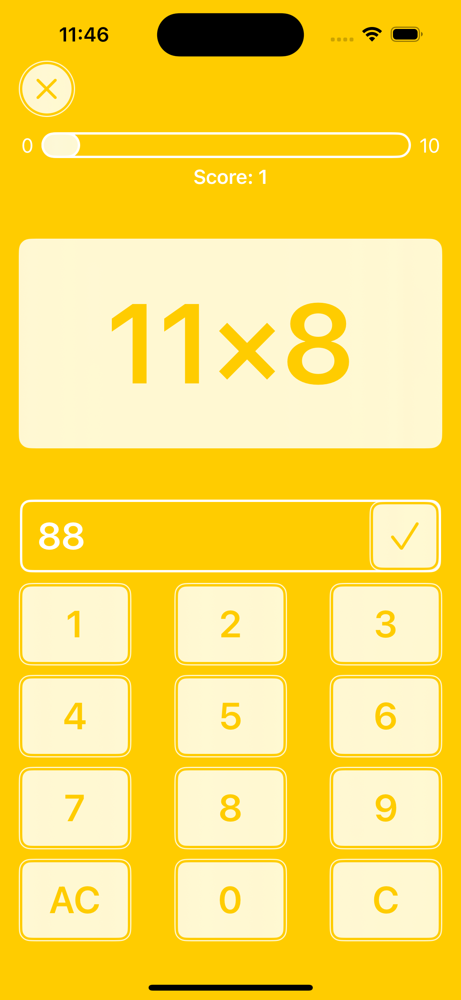
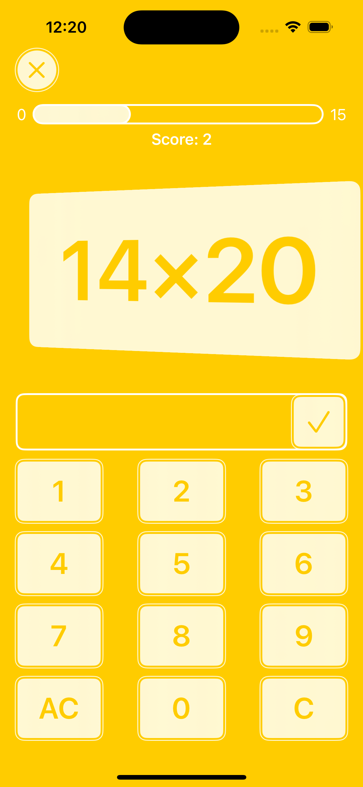
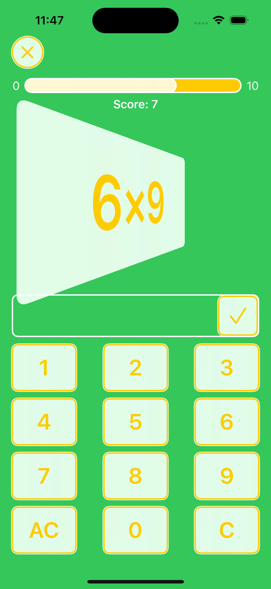
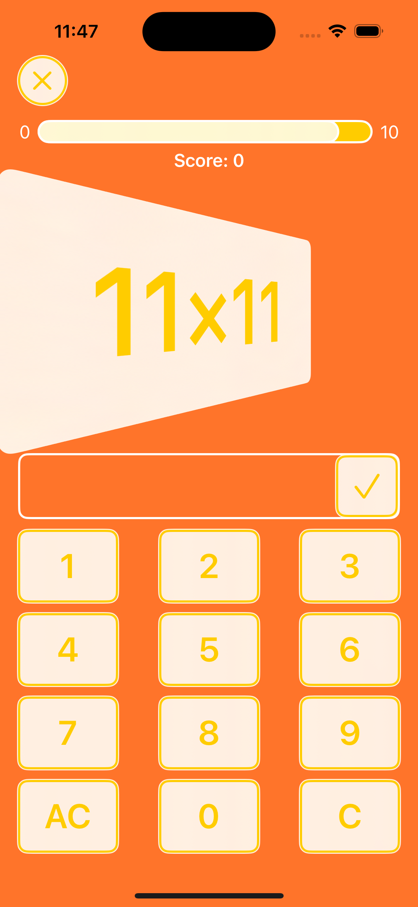
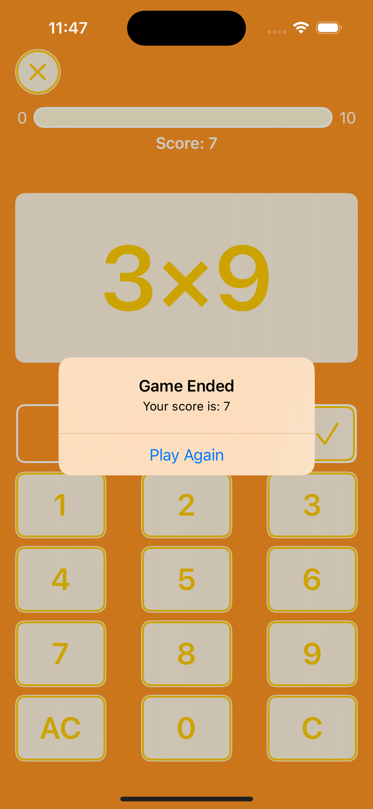
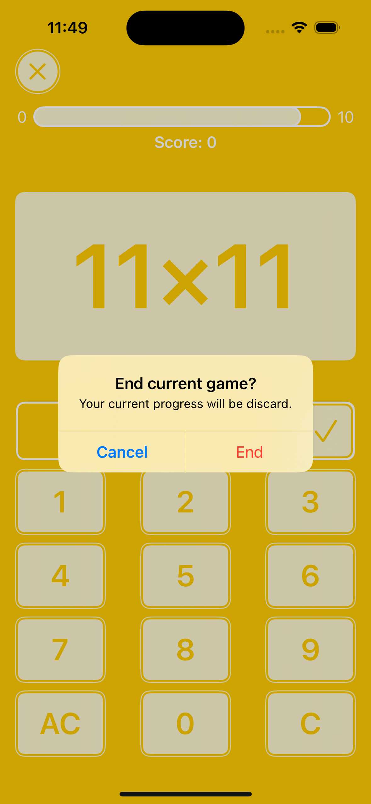
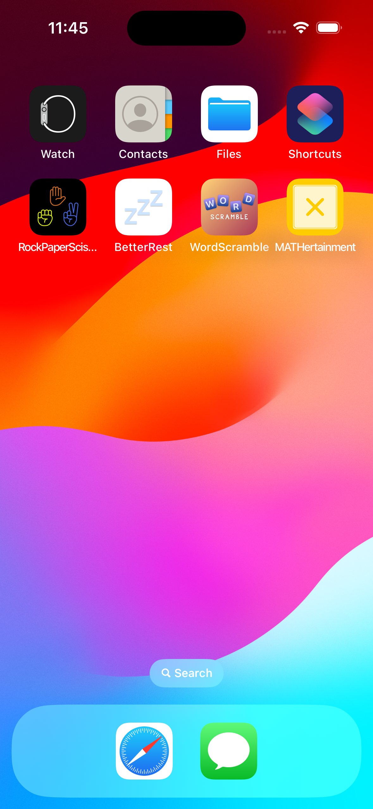

# Day 35: Milestone 2 - MATHertainment

MATHertainment is the 2nd milestone project in the [100 Days of SwiftUI](https://www.hackingwithswift.com/100/swiftui) challenge. It is yet another game on iOS, an edutainment game that helps children learn multiplication tables in a more enjoyable setting compared to a traditional classroom. The player needs to answer random mathematical questions in a game round to practice their multiplication skills. Before starting the game, the player is able to choose the number of total questions they want to play and the number of times tables included in the game. After the game concludes, the player can opt to play again, starting a new round of game with a different set of randomized multiplication questions. Building MATHertainment definitely got me to use all my SwiftUI skills acquired from all the previous projects so far, from basic skills such as building buttons with image labels and using [material type](https://developer.apple.com/documentation/swiftui/material) background, to more advanced skills such as building custom modifier, organizing the code into smaller view composition, and a bit of SwiftUI animations (which I squeezed every brain cells of mine to add such a small playful tweak to the UI, limited by my lack of creative imagination). I also got a chance to challenge myself to build a progress bar for the game, which is not in the project’s description at all. I guess I might have been just high when working on this project that I spontaneously thought of more requirements to suffer myself LOL.

## App current states
- After choosing the total number of questions and the number of multiplication tables to be included in a game round, the player needs to answer all the generated questions and score as high as they can.
- A number pad was implemented to allow the player to tap their answer without opening the system’s keyboard. The game-themed number pad helps the player feel more immersed in the game, especially when its target audience is children, so the player can be less distracted by the continuously opening and closing system’s keyboard. Moreover, the custom number pad helps eliminate undesired user inputs from the Apple’s system number pad, while adding the additional feature of two quality-of-life erasing keys (more below).
- The implemented number pad includes the “C” (Clear) key to clear the last digit of the user input, and the “AC” (All Clear) key to erase all presented user input, enhancing the game experience.
- A progress bar is present on the top of the game, keeping the player aware of the current progress, knowing how many questions they have answered and how many have left until the end of the game round.
- A restart/quit button is present on top that allows the player to terminate the current game and start all over if they want to. This improves the user experience as it does not trap the player in the current game play.

## Future improvements
- Speaking of immersive game experience, the result of the game is currently displayed by default SwiftUI alert. My brain is fried (🤯) after implementing all the above features, so I did not implement the game-themed result screen to display the player’s score after the game ends. This could be a small improvement to elevate the game experience even further.
- As with any kind of games, a leaderboard functionality to keep track of the player’s history and different game modes, such as speed mode, will never fail to stimulate and further engage the player in the app.
- While the game allows the player to choose the number of multiplication tables to include, the game UI has yet to support responsiveness when displaying longer mathematical expressions (e.g.: 1234 × 890). This could also be an improvement to improve the game experience.

## A glimpse of MATHertainment
<table>
  <tr>
    <td>The start screen of MATHertainment, prompting the player to enter the desired game settings.</td>
    <td>The player taps the number pad to enter the answer, enabled to erase their input fully or partially.</td>
    <td>The little rotating animation as the next question comes along, together with the progress bar being updated as the game goes on.</td>
  </tr>
  <tr>
    <td></td>
    <td></td>
    <td></td>
  </tr>
  <tr>
    <td>When the player answers correctly, the background animatedly changes to green before switching back to yellow.</td>
    <td>Similarly, when the player answers incorrectly, the background animatedly changes to red.</td>
    <td>The final result is displayed when the game ends, and the player is prompted to play again.</td>
  </tr>
  <tr>
    <td></td>
    <td></td>
    <td></td>
  </tr>
<tr>
    <td>Warning alert about losing current progress when the player wants to reset the game.</td>
    <td>(Quick) MATHertainment’s app icon designed by me ✨</td>
    <td>How MATHertainment looks on an iPhone home screen</td>
  </tr>
  <tr>
    <td></td>
    <td></td>
    <td></td>
  </tr>
 </table>

