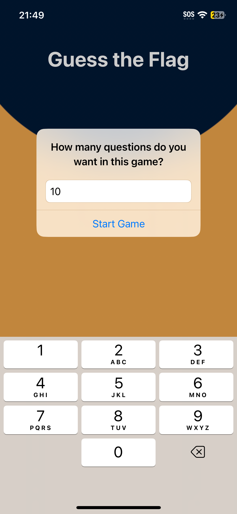
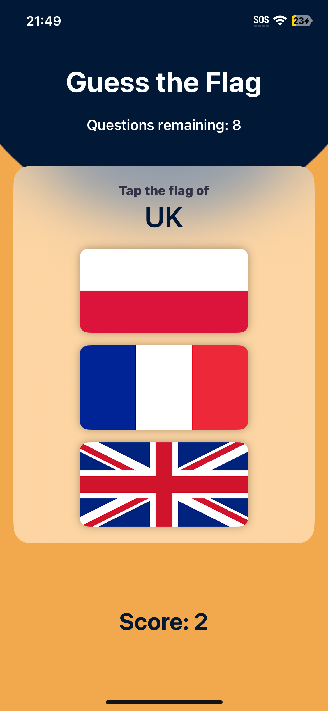
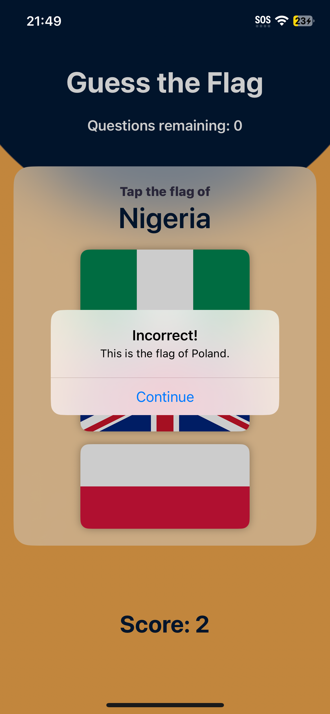
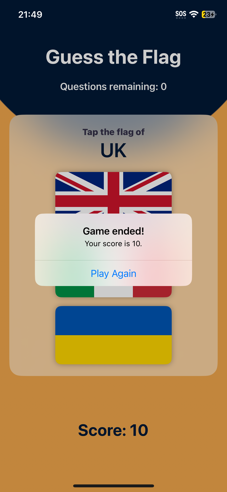
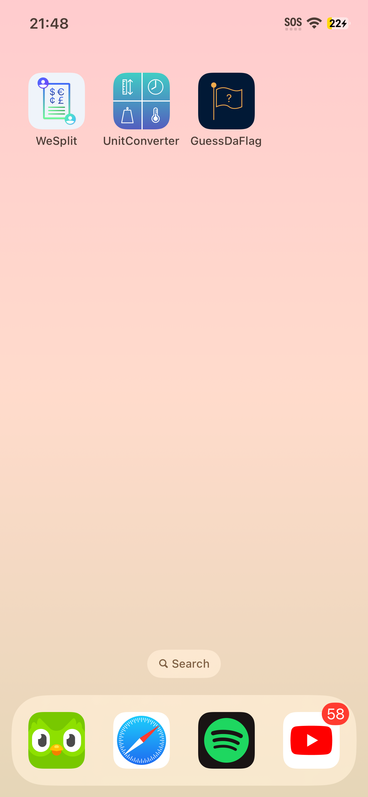
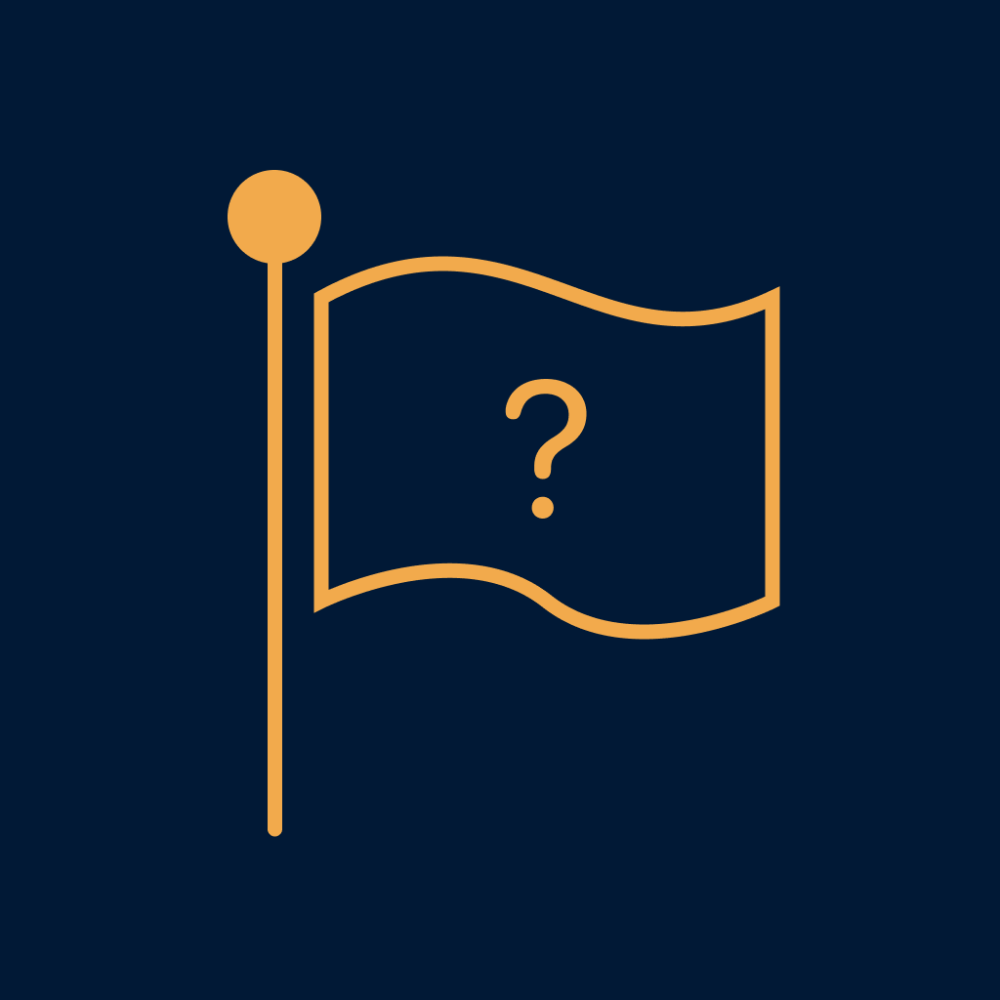

# Day 20-22: Project 2 - GuessDaFlag

This is the second project of my [100 Days of SwiftUI](https://www.hackingwithswift.com/100/swiftui) journey. This time, I got a chance to build an iOS mini game GuessDaFlag where, as suggested by the name, the player needs to guess the name of the country that the flag belongs to.

## App current states
- As per the project basic requirements, players need to guess the country flags among the available options. The player moves to the next question if they guess correctly, while an educated explanation will show up if they make an incorrect guess to help the player understand their mistakes and learn more about the flags.
- The game is further extended by prompting the player to enter their desired number of questions per game. The game concludes when the player finishes all the questions. The score is calculated out of the total number of questions.
- The player is prompted to play again once the game ends.
  
## Future improvements
- In this project, I've learned about building layouts with SwiftUI's stack views, and about simple UI polish using SwiftUI's color and gradient views, together with other small tweaks for fonts, spacing and alignment. At the moment, multiple modifiers are added to each view to change how it looks, and I can see how piling up the modifiers can become more messy as more customization is needed. I doubt there should be another way to organize and modularize the code to components to make it more maintainable. For now, I will just continue this 100-Day Challenge and see where it exposes me to next.
- All current flags asset are pulled from [HackingWithSwift repository](https://github.com/twostraws/HackingWithSwift) (thank you [Paul](https://github.com/twostraws) 🥇), so the number of available flags is limited. After a couple of games, the player can find the game repetitive and less educational. While the current resources suffice the purpose of learning new concepts in SwiftUI and quickly building a new app, the game would be more fascinating if more flags are included. A future improvement could be to find and fetch more flags from some APIs to populate the flags in the app.
- It seems tricky, funny and awkward to convert color hex code before we can style the UI using SwiftUI's `Color` data structure which relies on the RGB color system. Given a hex code at hand, I need to go somewhere else to convert my hex code to RGB color system, where each value for Red, Green and Blue is between 0 and 1. It is not even between 0 and 255, which makes it even more awkward since _decimal_ values between 0 and 1 sometimes cannot produce the exact color of desire because of, well, floating points and precision due to rounding. A better approach to minimize the inaccuracy might be to write an `extension` of `Color` and let it handle the conversion from color hex code to RGB, so fewer hard-coded roundings will be necessary.
- Not sure whether this is a pattern in iOS development with SwiftUI or not, but having several consecutive `Spacer()` to control and tweak the spacing between different UI elements seem unintuitive for me. Coming from web development, I find controlling the spacing using CSS' `margin` and `padding` properties, to name a few, in combination with many others seems way more manageable and predictable. There's...gotta be a similar way in SwiftUI, right...?

## A glimpse of GuessDaFlag
<table>
  <tr>
    <td>Prompting the player to enter the desired number of questions.</td>
    <td>The regular state of the game: Let's guess the flag!</td>
    <td>An educated explanation when the player makes an incorrect guess.</td>
  </tr>
  <tr>
    <td></td>
    <td></td>
    <td></td>
  </tr>
  <tr>
    <td>Showing the final score once the game ends and prompting to play again.</td>
    <td>How GuessDaFlag looks like on an iPhone home screen.</td>
    <td>GuessDaFlag app icon designed by me ✨</td>
  </tr>
  <tr>
    <td></td>
    <td></td>
    <td></td>
  </tr>
 </table>
