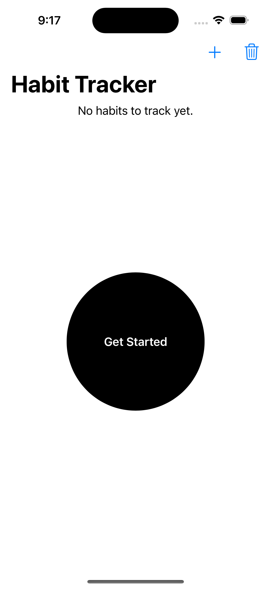
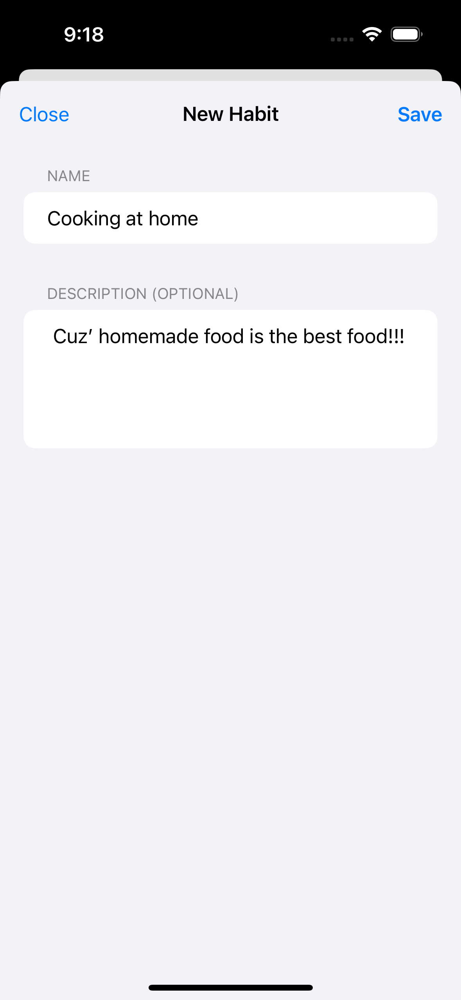
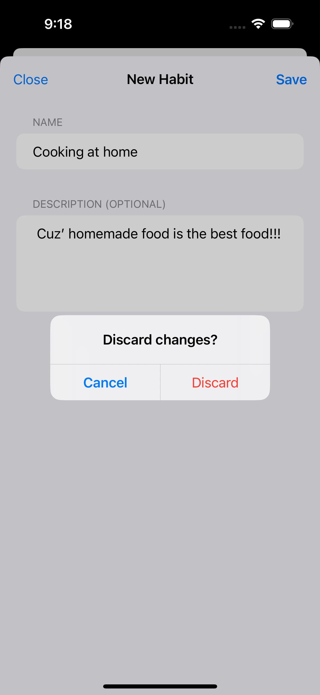
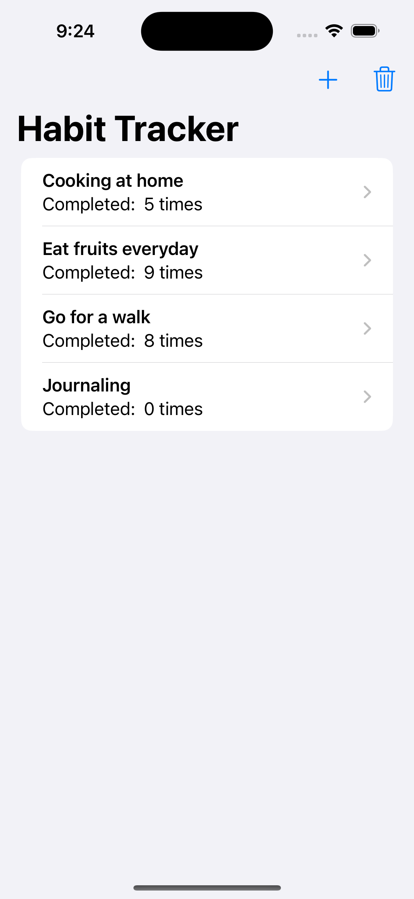
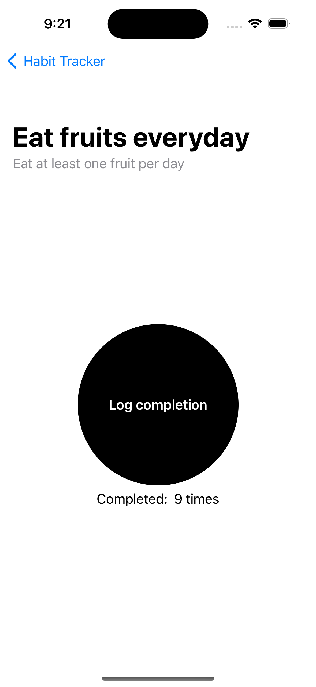
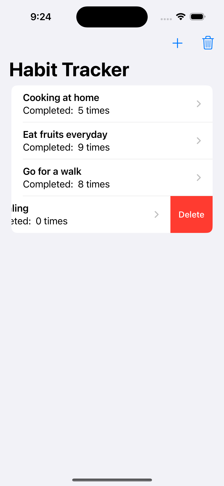
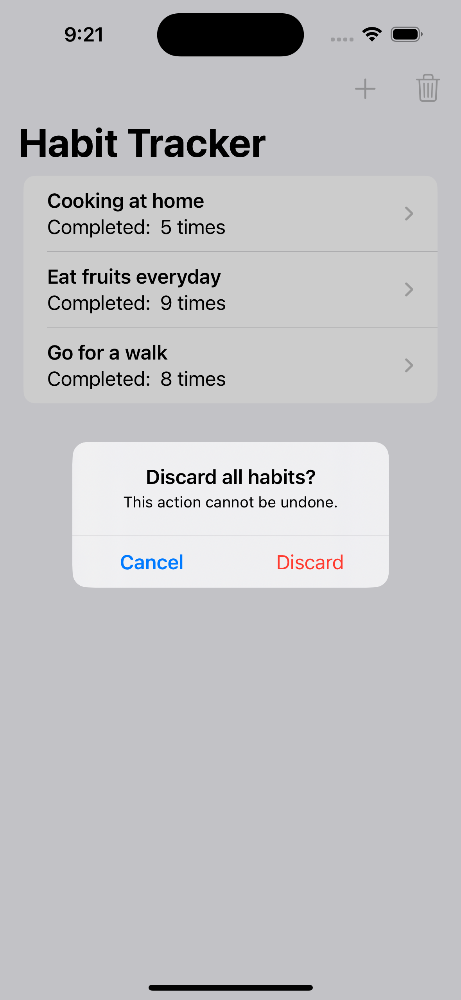
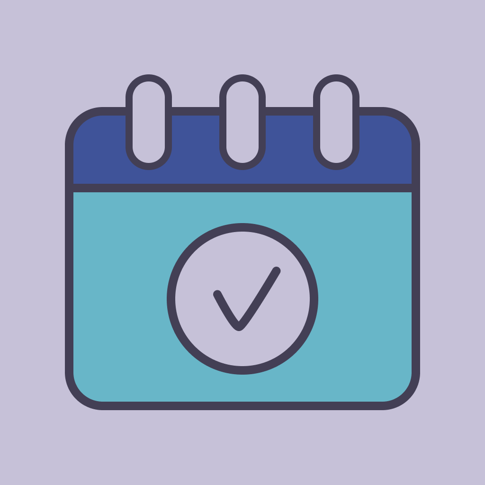
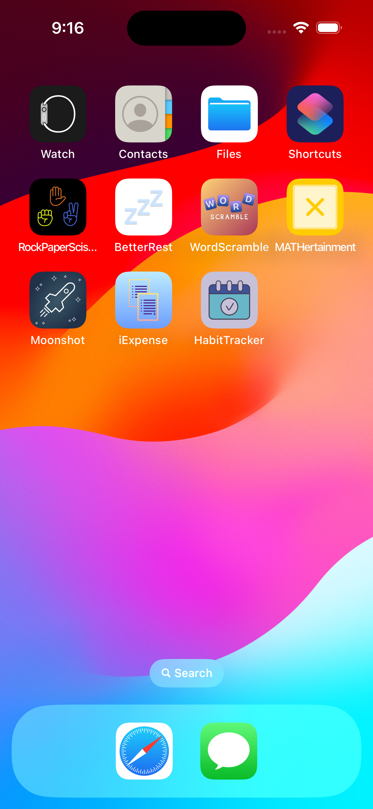

# Day 47: Milestone 3 - HabitTracker
Yet another milestone has been reached in my [100 Days of SwiftUI](https://www.hackingwithswift.com/100/swiftui) journey. This time, I got to build a simple habit tracking app, where a user can document the habits they want to track and log the completion times. HabitTracker is a simple iOS app that has room for many many features ideas. In the current version of _HabitTracker_, the minimum supported (major) features are the ability to create new habits to track and the ability to log the completion times for each habit.

## App current states
- The user is able to create and start tracking a new habit by inputting the habit’s name and optionally a description. Clicking on a habit on the screen will navigate to the habit details screen, where the user can increase the habit completion times.
- The user is able to delete a habit they no longer want to track, or a habit they accidentally created previously.
- Habits in the main screen are sorted in alphabetical order.
- All data is saved in `UserDefaults` to persist between app uses. Successfully clearing all habits in the app also erases the data from `UserDefaults`.

## Future improvements
There are a lot of improvement ideas, big and small, that can be done to enhance the app’s user experience in terms of usability, usefulness and desirability.
- It would be useful to log the start date of a habit and have some sort of visual tracker, such as a calendar and/or graph, for better visualization.
- All entered data should be editable to increase flexibility for the users in case they make mistakes.
- The app would be more useful and more informative if it allows tracking habits in different frequencies, such as daily, weekly, etc. (E.g.: go for a 30-minute walk every day, work out 3 times a week, cook twice daily, etc.)
- It would be cool if there is some analytics data to inform the users of their progress. (E.g.: During the six months since you started, you cook once daily on average).
 

## A glimpse of HabitTracker
<table>
  <tr>
    <td>Informative message and CTA when there are no habits to track.</td>
    <td>A pop-up form allowing the user to create a new habit.</td>
    <td>Alert the user about discarding unsaved changes when closing the form.</td>
  </tr>
  <tr>
    <td></td>
    <td></td>
    <td></td>
  </tr>
  <tr>
    <td>A regular main screen with habits being tracked.</td>
    <td>In the habit details screen, the user can log a new completion.</td>
    <td>The user can delete a habit they no longer want to track.</td>
  </tr>
  <tr>
    <td></td>
    <td></td>
    <td></td>
  </tr>
  <tr>
    <td>An irreversible action warning when the user wants to mass delete all the habits.</td>
    <td>HabitTracker app icon designed by me ✨</td>
    <td>How HabitTracker app looks on iPhone home screen</td>
  </tr>
  <tr>
    <td></td>
    <td></td>
    <td></td>
  </tr>
<table>
