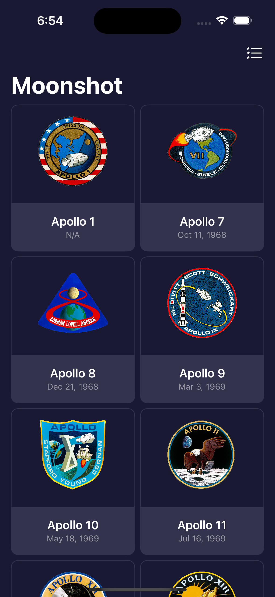
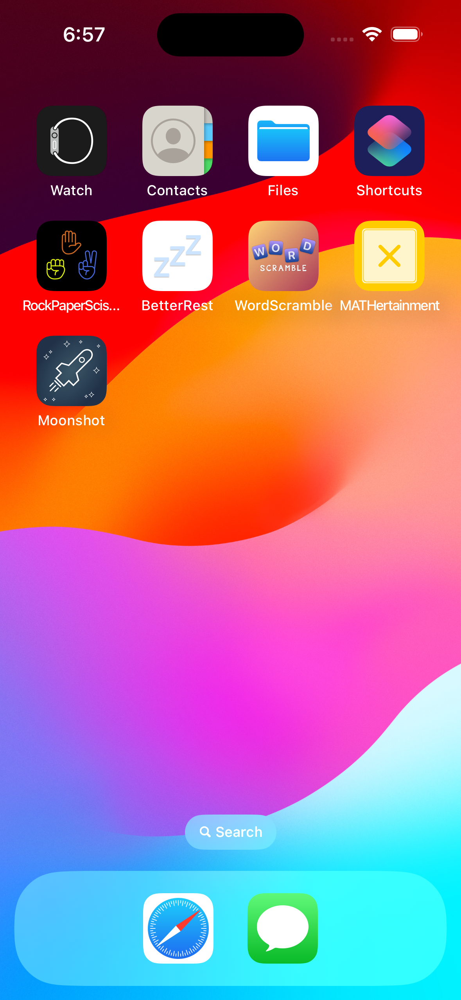

# Day 39-42: Project 8 - Moonshot

This is the 8th project in my [100 Days of SwiftUI](https://www.hackingwithswift.com/100/swiftui) journey, where I built an info app called Moonshot which showcase all NASA’s space missions in the past, along with the crew of astronauts and their descriptions and roles in each mission (thank you. I’ve gained more hands-on experiences on pushing new views to `NavigationStack`, how to use `LazyVGrid`/`LazyHGrid`, how to create adaptive grid to be responsive to various screen sizes, and also how to leverage `Codable` protocol and use it to encode/decode JSON data. Working on this project, I realized how all of these skills are fundamental in SwiftUI, yet are very powerful when it comes to building complex apps, which makes me excited to look forward to the upcoming challenges approaching in the journey ahead.

Disclaimer: All json data in this project is downloaded from [HackingWithSwift repository](https://github.com/twostraws/HackingWithSwift) (thank you [Paul](https://github.com/twostraws) for preparing the files for us 🥇)

## App current states
- The app first presents a catalog of all available missions. The user can switch to view the catalog in a list or in a grid using the switch icon at the top right of the toolbar.
- Tapping a mission on the first screen will take the user to the second screen where more details for the chosen mission, such as the mission highlights, the crew and launch date (if available), are shown.
- Tapping a crew member from the crew list will then introduce the user to the third screen which displays more info about the chosen astronaut, such as their images and description.
  
## Future improvements
- I think it would be nicer if the info used in this app could be fetched from some sort of online API instead of being loaded from a static json file. This way, when there is a new future space mission launch, the app will automatically be updated without the manual update on the development side. The data can then be cached locally in the user’s device for offline access. However, considering a space mission launch does not happen frequently, and there aren’t a ton of missions available, it is not a terrible idea to prepare and include a static JSON file in the app bundle and load the data from there. A manual update from the developer every few months or even years seems not too bad after all.

## A glimpse of Moonshot
<table>
  <tr>
    <td>The mission catalog in adaptive grid view mode.</td>
    <td>Scrolling down to see all the available missions in the grid.</td>
    <td>The mission catalog in list view mode.</td>
  </tr>
  <tr>
    <td></td>
    <td></td>
    <td></td>
  </tr>
  <tr>
    <td>Scrolling down to see all the available missions in the list.</td>
    <td>Tapping on a mission will bring the user to the mission info screen.</td>
    <td>Scroll down the mission info screen to see the list of mission crew.</td>
  </tr>
  <tr>
    <td></td>
    <td></td>
    <td></td>
  </tr>
  <tr>
    <td>Tapping on a crew member to see more info about the astronaut.</td>
    <td>Moonshot app icon designed by me ✨</td>
    <td>How Moonshot app looks on an iPhone home screen.</td>
  </tr>
  <tr>
    <td></td>
    <td></td>
    <td></td>
  </tr>
 </table>
