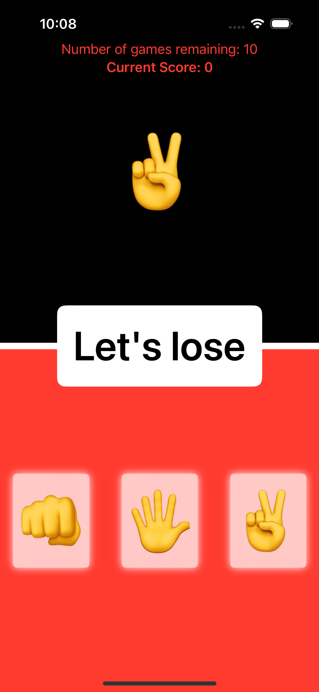
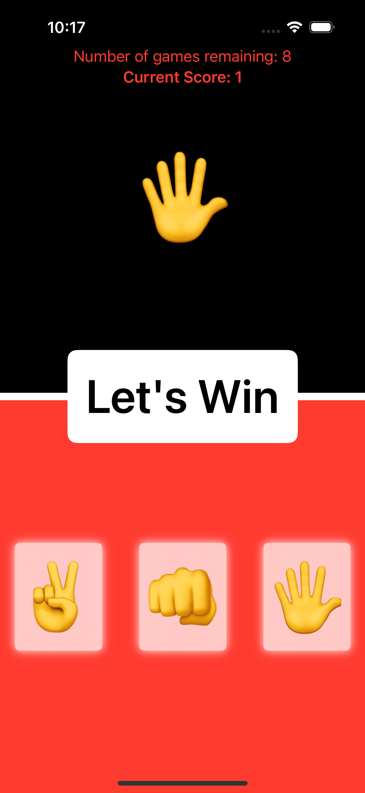
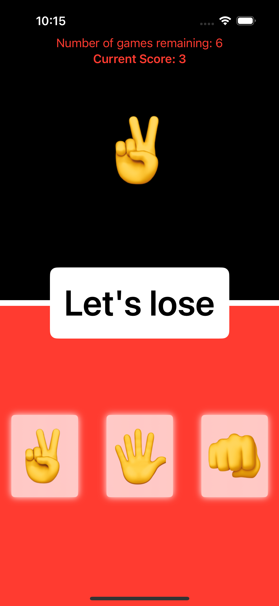
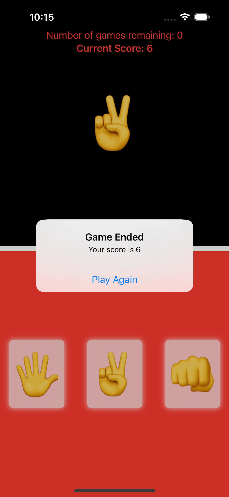
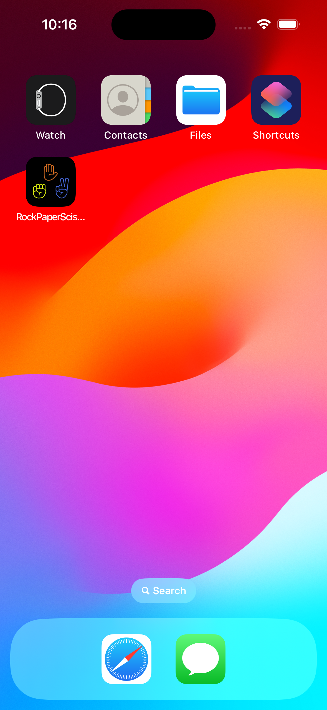
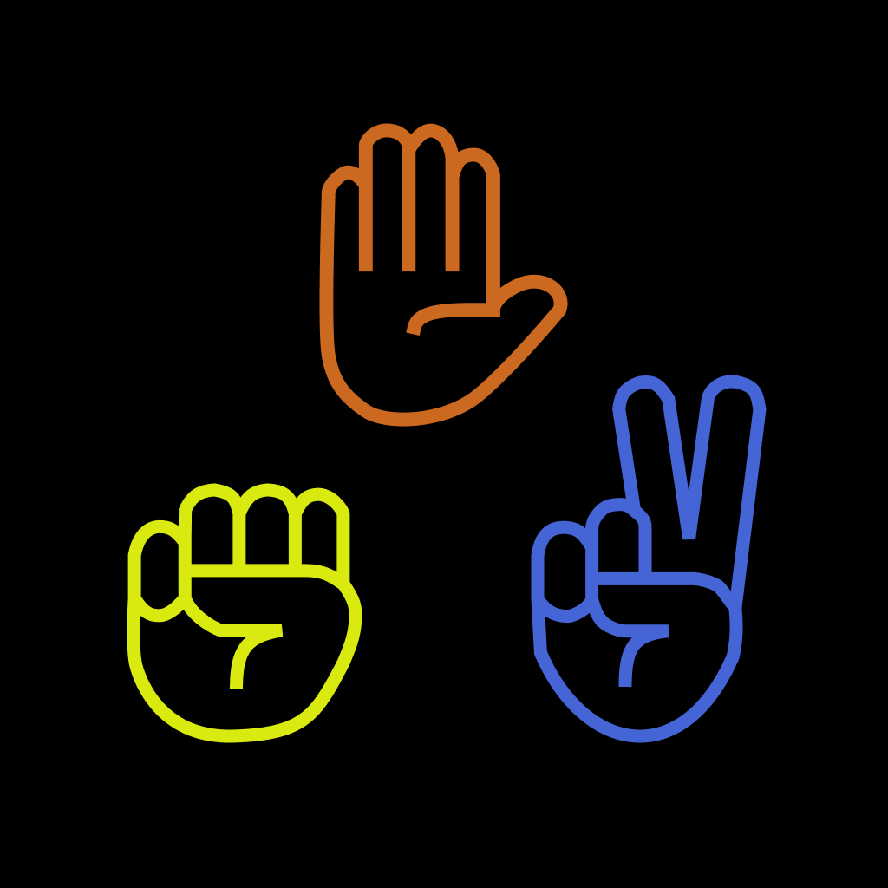

# Day 25: Milestone 1 - RockPaperScissors
This is the first milestone project of my [100 Days of SwiftUI](https://www.hackingwithswift.com/100/swiftui) journey, in which I bring together all the acquired skills from Project 1 to Project 3 and build a new iOS app: the classic RockPaperScissors game.

## App current states
- The game contains 10 rounds by default. Each round randomly prompts the player to win or to lose against the app. The player scores 1 point if they choose the correct move to "win" or "lose" accordingly.
- To make it more challenging and stimulating for the player, the move buttons are shuffled every round, making it more tricky to tap the correct move.

## Future improvements
- Given the fast-faced nature of the game, it would be even more fascinating to incorporate a time-based mode in the game where the player will not be limited by 10 rounds per game. Instead, they can keep playing as long as they "win" against the app, and stop once they make a wrong move.
- A leaderboard is another interesting feature to enhance this app in addition to the time-based game mode, where the board keeps track of the highest number of rounds and/or the most number of rounds in the shortest amount of time (similar to velocity, sort of).

## A glimpse of RockPaperScissors
<table>
  <tr>
    <td>Starting state of the game with 10 rounds</td>
    <td>Each round randomly prompts the player to win or lose</td>
    <td>The moves are shuffled every round to add stimulation</td>
  </tr>
  <tr>
    <td></td>
    <td></td>
    <td></td>
  </tr>
  <tr>
    <td>The final result shows up once the game ends, and the player is prompted to play again</td>
    <td>How RockPaperScissors app looks on iPhone home screen</td>
    <td>RockPaperScissors app icon designed by me ✨</td>
  </tr>
  <tr>
    <td></td>
    <td></td>
    <td></td>
  </tr>
 </table>
