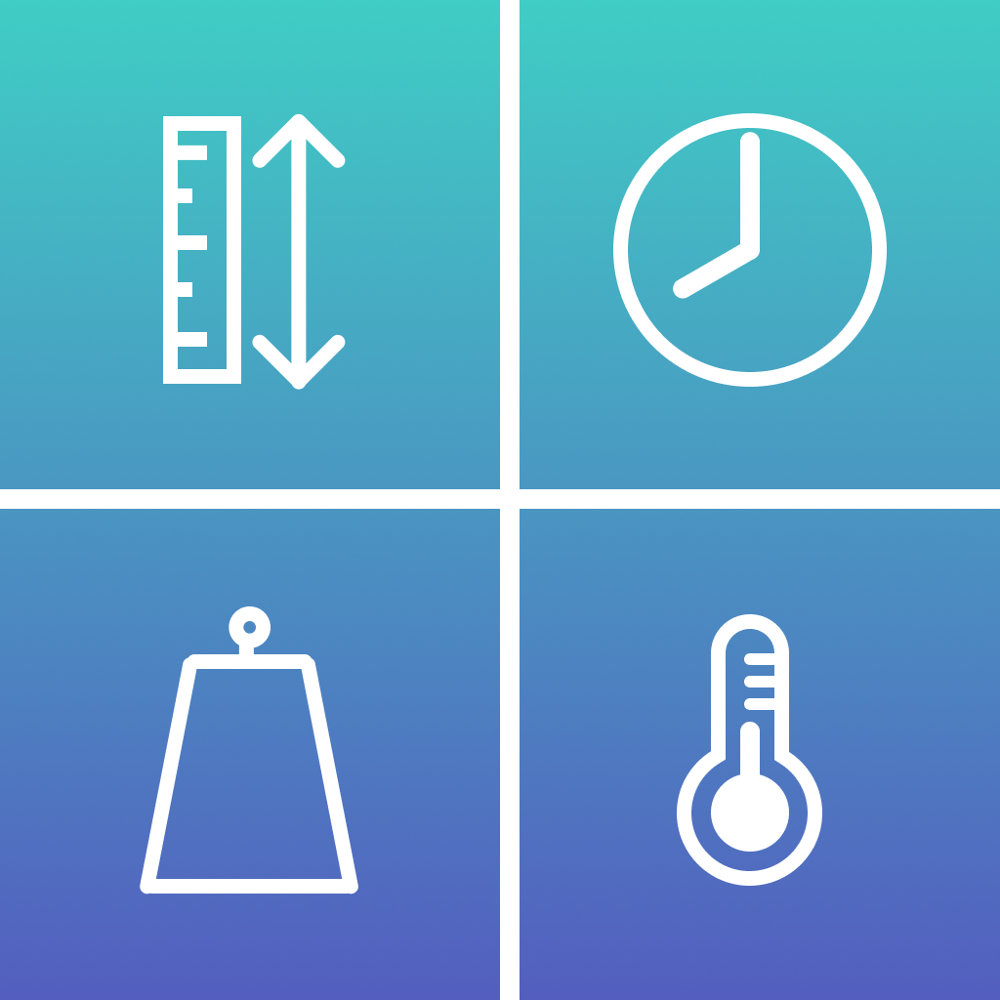

# Day 19: Mini Challenge 1 - UnitConverter

This is a mini challenge on Day 19 of my [100 Days of SwiftUI](https://www.hackingwithswift.com/100/swiftui) journey, where I built UnitConverter - a simple iOS app enabling measurement units conversion. The user chooses a measurement category among mass, speed, volume, temperature, angle, area, length and time. The user selects their desired units of conversion and enters a value. After that, the app will convert the entered value to the chosen units.

## App current states
- While the challenge only requires building a converter for only one category (e.g.: Volume), I extended the app and support unit conversion in multiple categories where the user is first prompted to select a desired category of measurement. Luckily, SwiftUI's built-in generic structure [Measurement](https://developer.apple.com/documentation/foundation/measurement) and abstract class [Dimension](https://developer.apple.com/documentation/foundation/dimension) cover most of the tedious calculation and provide many functionalities to handle the computing work out of the box, so supporting multiple unit conversions turns out not as boring and monotonous as it sounds. Thank you Apple 🍎 for making my developer experience so wonderful and enjoyable.
- The app uses `keyboardType(.numbersAndPunctuation)` to support negative values, which can be useful in temperature conversion. A downside of this feature is that the keyboard now has many other special characters other than the negative sign `-`. My initial decision was to use `keyboardType(.decimalPad)` which supports decimal values but lacks the support for negative values. I later switched to using `keyboardType(.numbersAndPunctuation)` instead, so error handling is in place to notify the users of the invalid values to help them effectively recover from errors. It would be nice if Apple's design system were expanded to include a new keyboard type that supports both decimal values and negative values for use cases like this.

## Future improvements
- The purpose of this challenge is to build a new app fast and keep it simple. As a result, the data architecture is a bit awkward as there is some hard-coded data here and there. In addition, the app does not follow **_the Open-Closed Principle_**, which states that entities should be open for extension but closed for modification. Suppose we want to support the unit conversion of a new category, modification will be required in several places throughout the app. A better data structure, such as class, may be beneficial to make the app more maintainable and scalable.

## A glimpse of UnitConverter
<table>
  <tr>
    <td>Start screen with default values for each input.</td>
    <td>The result is dynamically computed and updated.</td>
    <td>Decimal values are supported.</td>
    <td>Negative values are supported.</td>
  </tr>
  <tr>
    <td></td>
    <td></td>
    <td></td>
    <td></td>
  </tr>
  <tr>
    <td>Error handling for invalid inputs.</td>
    <td>Error handling for invalid inputs.</td>
    <td>How UnitConverter app looks on iPhone home screen.</td>
    <td>UnitConverter icon designed by me ✨</td>
  </tr>
  <tr>
    <td></td>
    <td></td>
    <td></td>
    <td></td>
  </tr>
</table>
