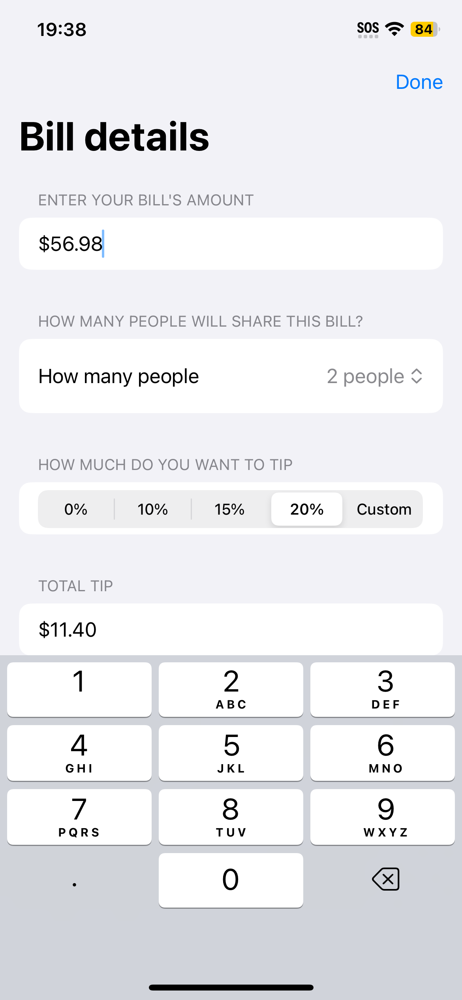
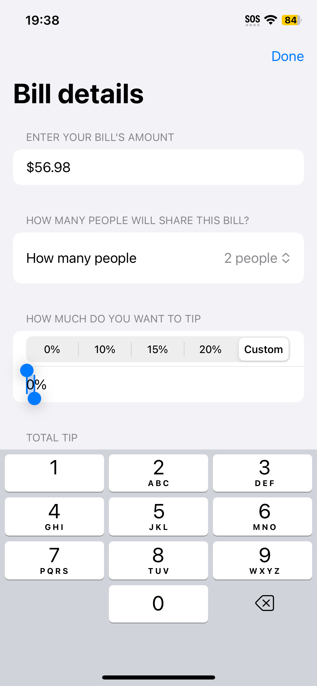

# Day 16-18: Project 1 - WeSplit

This is the very first project of my [100 Days of SwiftUI](https://www.hackingwithswift.com/100/swiftui) journey, which is to build WeSplit - a simple iOS app that streamlines the sharing bills process. The user enters the bill's amount, the number of people who will share the bill, and the amount of tip the group wishes to go with. With the given information, WeSplit will dynamically calculate the amount that each person needs to pay, _assuming the bill will be shared equally_.

## App current states
- The project guide in the mentioned course only asks to calculate the amount that each sharee needs to pay, which is present in the current app.
- The guide also suggests adding a component to display the total amount (bill and tip combined) before sharing. This feature is present in the current app.
- The app is further extended as another component is added to calculate and display the total amount of tip before sharing. I added this feature after talking to my friends and realized a desire to know the tip based on the pre-tax bill, as in Canada, tips are computed on the already taxed bill, which some people believe is unfair since gratuities should not be applicable to taxes.
- While not included in the project guide, I added a feature to support inputting the custom number of sharees, as well as the custom tip percentages. When the user chooses the "Custom" option for each field, a new input will show up accordingly in the corresponding field where they can provide the desired info. This feature will increase the usability and usefulness of WeSplit even more.

## Future improvements
- There is room for improvements in input field formatting. While all the monetary amount is formatted with Apple's currency formatter where the currency symbol is prefixed to the input string, as well as the percent sign is suffixed to the tip percentage, these symbols can be manually deleted by the user, which is not my preference of persisting this symbol on the screen at all time. I hope to learn more about SwiftUI and come up with a neat solution for this in the future.
- It would be nice to display only the (dimmed gray) placeholder value for the input fields instead of the actual default value _if it is **the first time**_ the user enters the info in an input field in the current calculation. This behaviour should be consistent to all input fields. For my future self: To support this feature, maybe adding a trigger component to clear all inputs and start a new bill calculation would be nice.
- Regarding the previous point, alternatively, it is okay to display the default values upon opening the app, but if it is the first time the user interacts with an input field, after they tap on the field, reset the present input string and set the cursor to the beginning of the input field.  

## A glimpse of WeSplit
<table>
  <tr>
    <td>Regular workflow</td>
    <td>Custom number of sharees</td>
    <td>Custom tip percentage</td>
  </tr>
  <tr>
    <td></td>
    <td></td>
    <td></td>
  </tr>
  <tr>
    <td>Decimal pad for bill amount</td>
    <td>Number pad for custom number of people</td>
    <td>Number pad for custom tip percentage</td>
  </tr>
  <tr>
    <td></td>
    <td></td>
    <td></td>
  </tr>
  <tr>
    <td>A humorous error message when there is 0 sharee :)</td>
    <td>WeSpit app icon designed by me ✨</td>
    <td>How WeSpit app looks on iPhone home screen</td>
  </tr>
  <tr>
    <td></td>
    <td></td>
    <td></td>
  </tr>
 </table>
