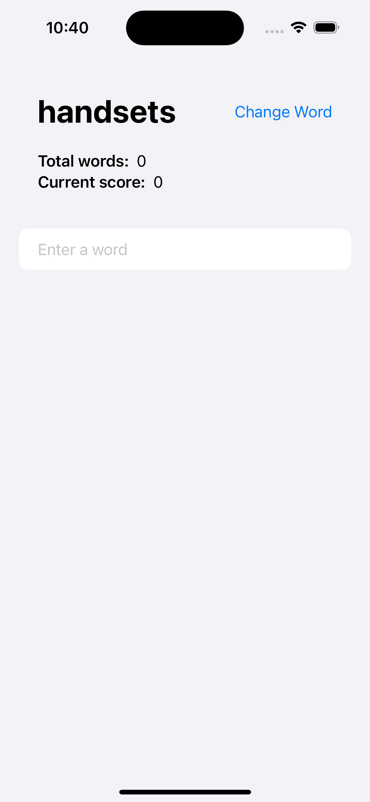
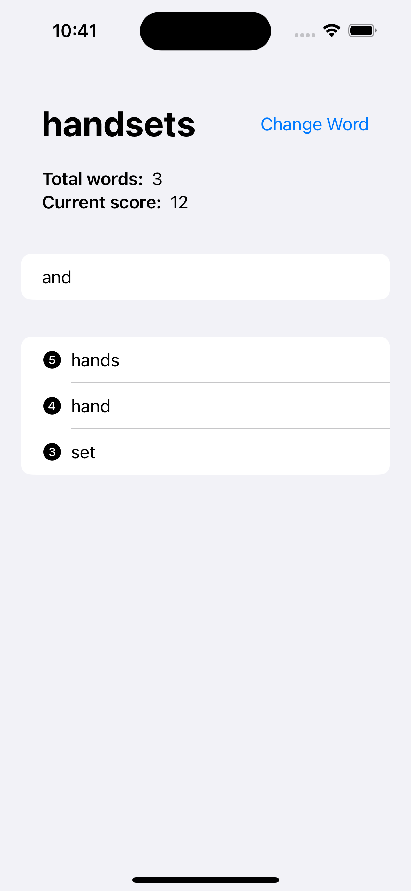
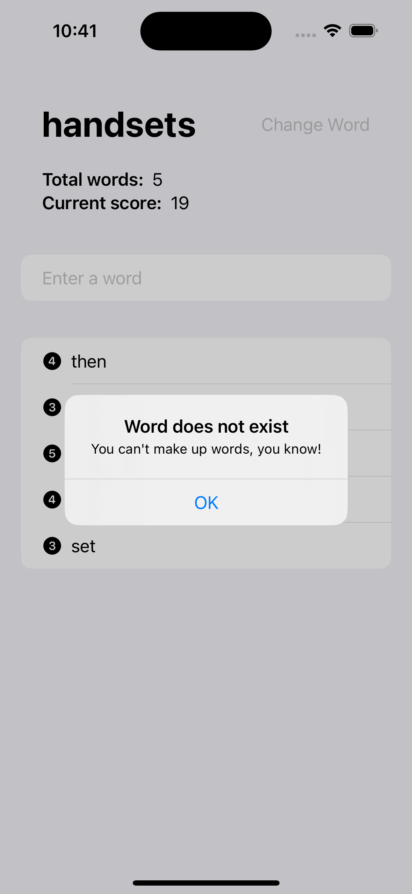
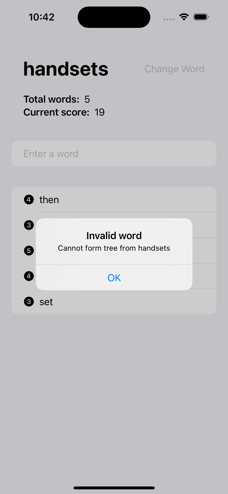
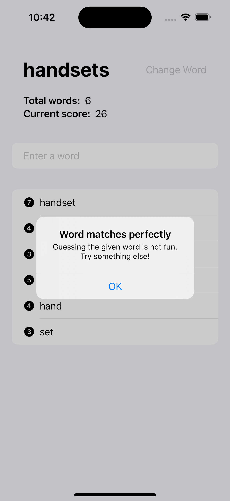
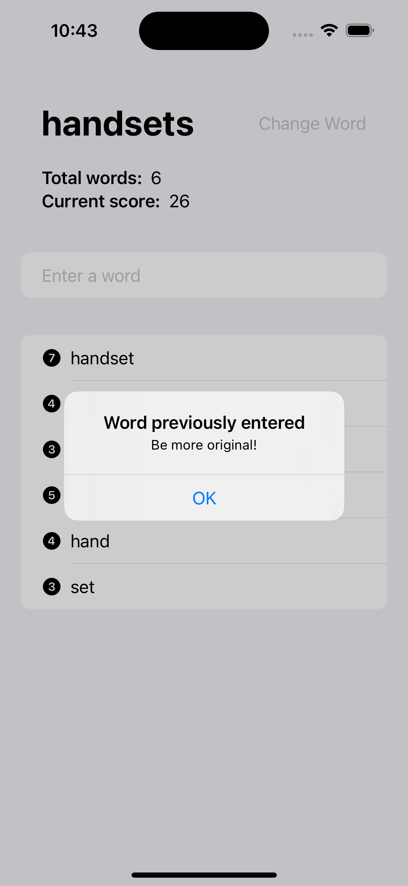
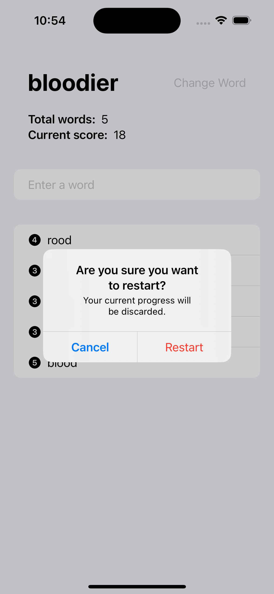
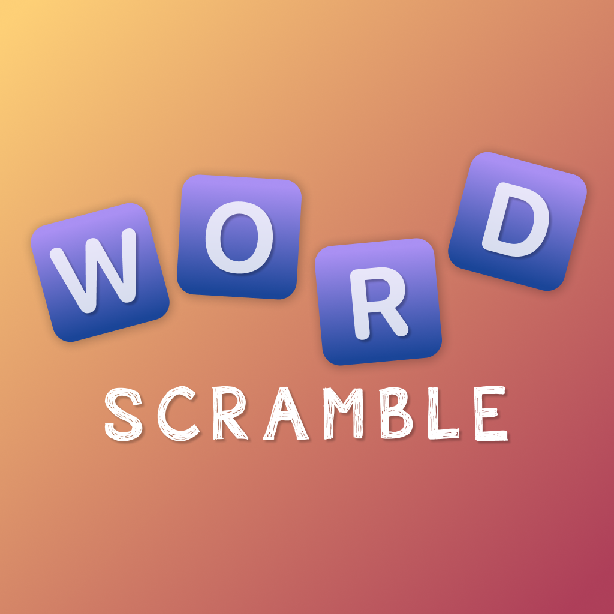
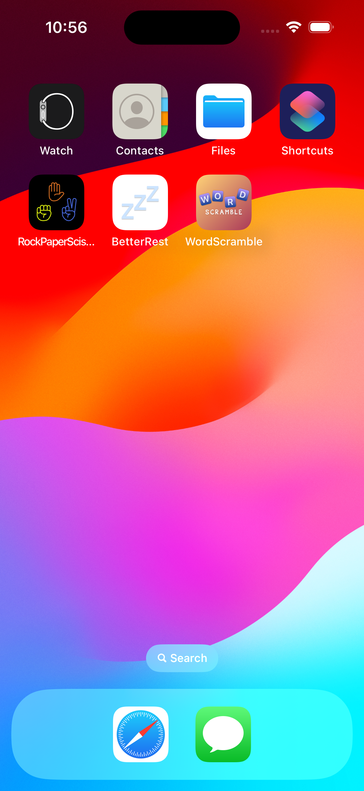

# Day 29-31: Project 5 - WordScramble

WordScramble is the 5th project, and also my 3rd game app on iOS, in my [100 Days of SwiftUI](https://www.hackingwithswift.com/100/swiftui) journey. The player needs to come up with as many (valid) words as possible, where the word must be composed from the letters present in the prompted root word, chosen randomly by the app from the resource of 10000 8-letter words (thank you again, [Paul](https://github.com/twostraws), for the [list of all the words](https://github.com/twostraws/HackingWithSwift) 🥇).

## App current states
- As described above, given a prompted root word, the player needs to come up with as many valid words composed from its letters as possible. Valid words are those 1) that exist in the dictionary, determined by [Apple’s UIKit’s UITextChecker](https://developer.apple.com/documentation/uikit/uitextchecker) and meaning it should be correctly spelled, 2) composable from the letters in the root word, 3) must not be previously guessed, and 4) must not match the root word exactly (otherwise there is no fun).
- The score is calculated by summing up all the total numbers of letters in the guessed words.
- The player can change the root word at any point during the game. The game will alert the player of the current progress, if it exists, being discarded if the root word is changed. Otherwise, if no progress is detected, the root word will be changed immediately upon triggering changing the root word.

## Future improvements
- This one is outside the scope of this project, but oh boy I really wish SwiftUI had its own TextChecker, so developers do not need to manually bridge the gap of translating the Swift’s strings to Objective-C’s strings…

## A glimpse of WordScramble
<table>
  <tr>
    <td>The starting state of WordScramble.</td>
    <td>The score is updated as the player guesses the words.</td>
    <td>Error alert when the guessed word does not exist in the dictionary.</td>
  </tr>
  <tr>
    <td></td>
    <td></td>
    <td></td>
  </tr>
  <tr>
    <td>Error alert when the guessed word cannot be composed from the root word’s letters.</td>
    <td>Error alert when the player guesses the root word itself.</td>
    <td>Error alert when the player attempts to guess the previously guessed word.</td>
  </tr>
  <tr>
    <td></td>
    <td></td>
    <td></td>
  </tr>
<tr>
    <td>Warning alert about losing current progress when the player wants to reset the game.</td>
    <td>WordScramble’s app icon designed by me ✨</td>
    <td>How WordScramble looks on an iPhone home screen</td>
  </tr>
  <tr>
    <td></td>
    <td></td>
    <td></td>
  </tr>
 </table>
