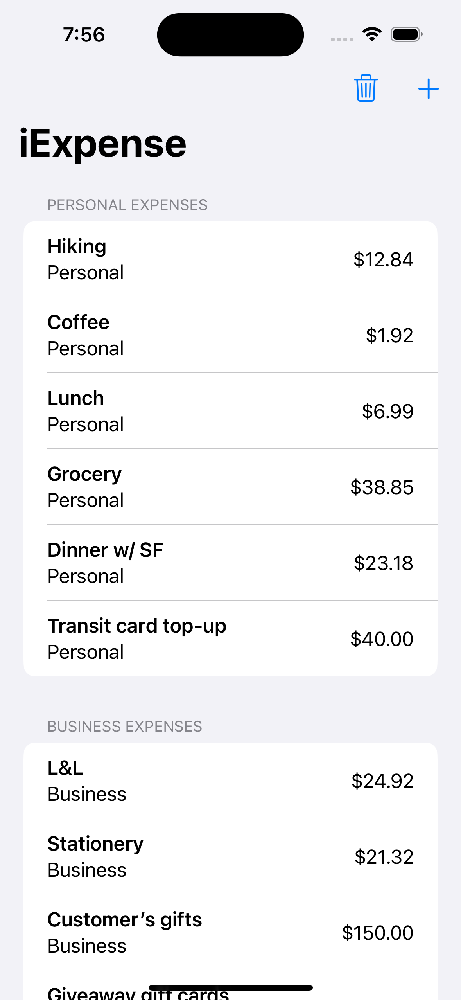
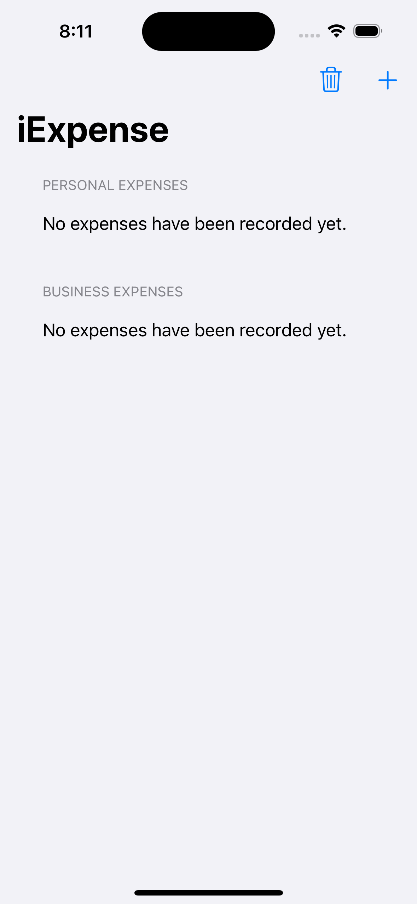
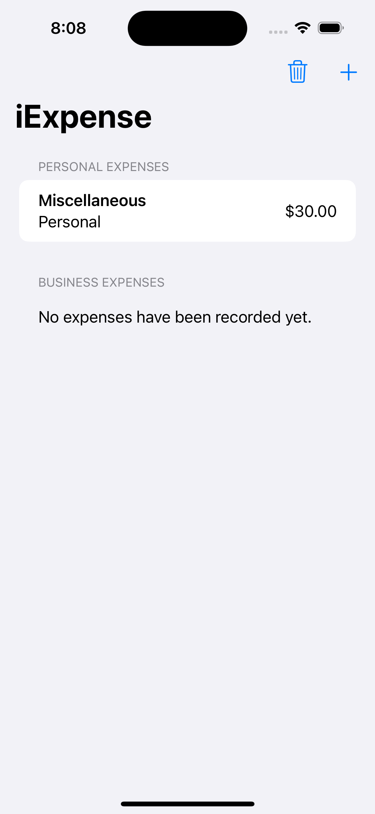
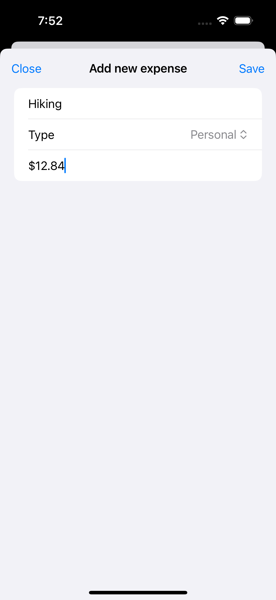
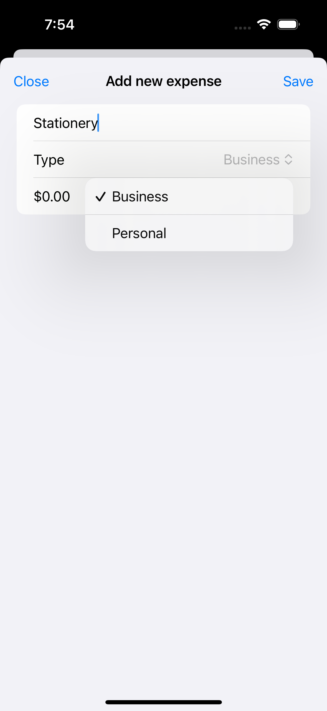
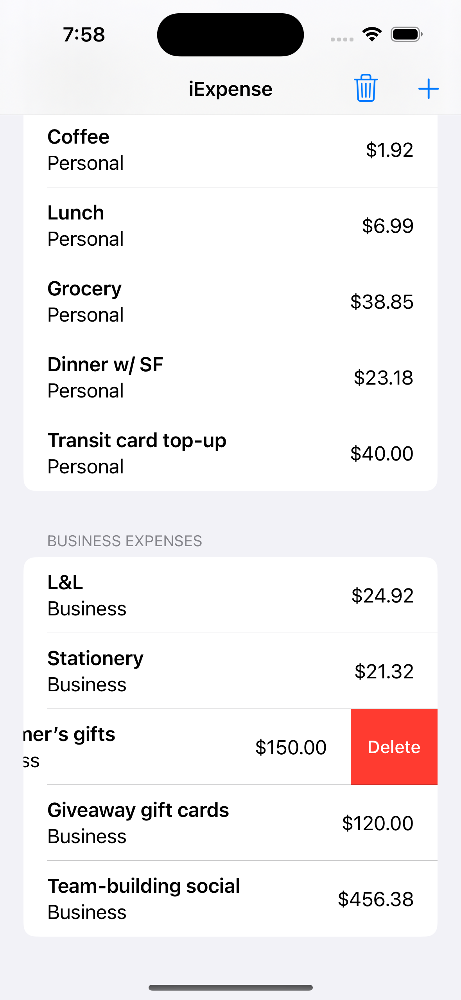
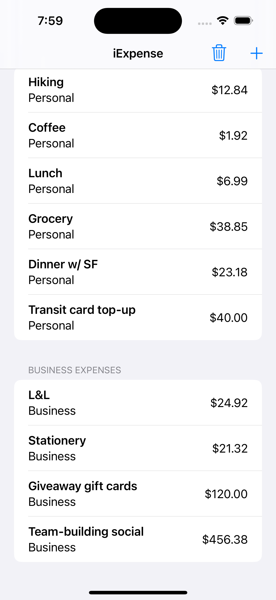
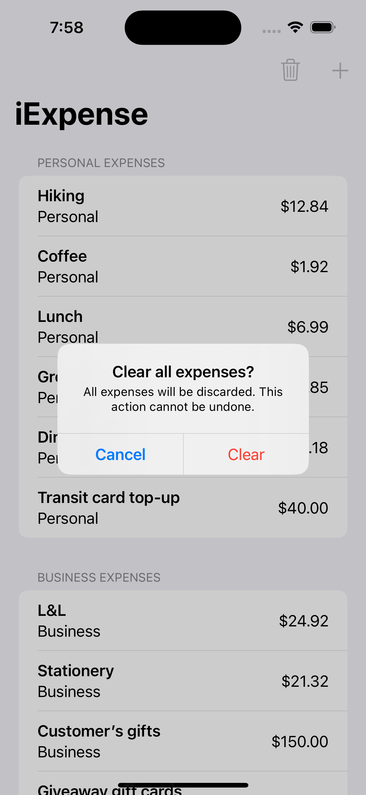
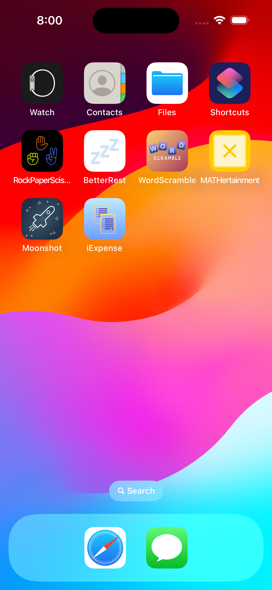
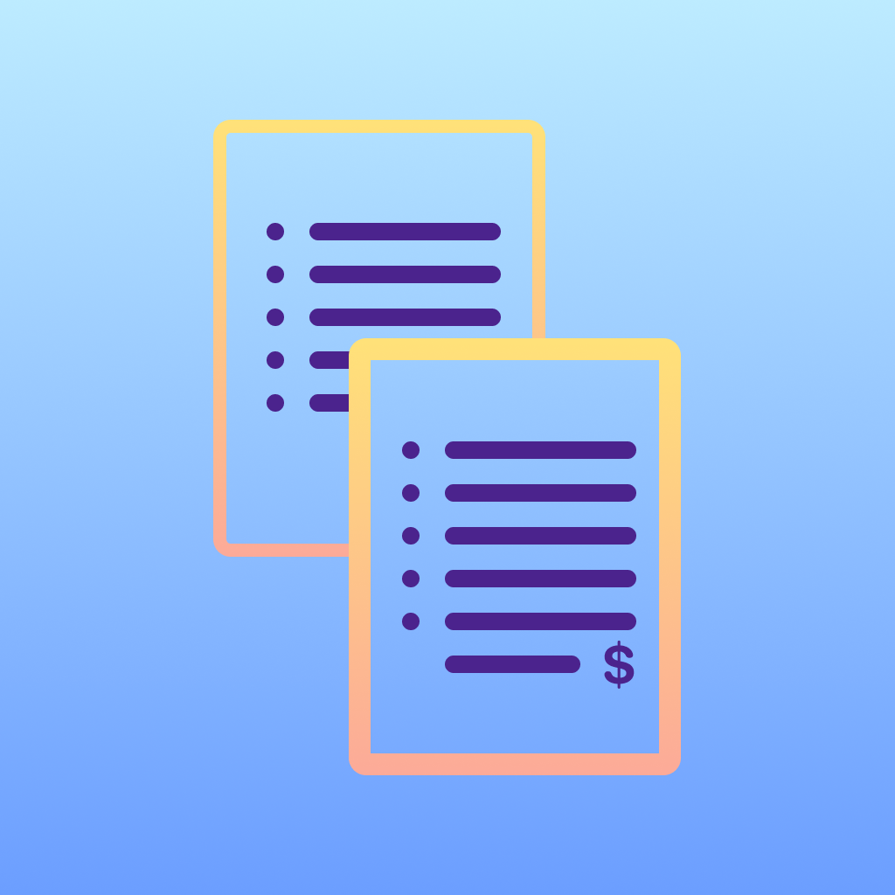

# Day 36-38: Project 7 - iExpense

This is the 7th project in my [100 Days of SwiftUI](https://www.hackingwithswift.com/100/swiftui) journey: an expenses tracker iOS app. This is an interesting and practical project because whoever is financially responsible would know for a fact that tracking expenses and spending habits is a necessary task to stay on top of our budgets and financial standing. For years ever since I started university and lived alone, I have been tracking my monthly/yearly expenses using the traditional Excel sheet. The problem with this approach is that I need to use my laptop every time I want to update my spending history. It is a bit inconvenient given that my access to my laptop is more limited compared to the access I have to my phone, and also that I do not want to start my laptop from its shutdown mode, and then launch Excel and open the correct tracking sheet which takes _too_ many clicks (yes, too many user interaction compared to an equivalent phone app), just to note down several lines of expenses history. While it has been going okay as I eventually decided to set aside some time to update the sheet a couple of times every month, I have been having this idea of building an expenses tracker, at least for personal use, that gives me easier access with my phone. Admittedly, my procrastination got me put off this idea for a very long time, but now **100 Days of SwiftUI** finally helps me kick off the implementation for this app. Exciting!

## App current states
- The app allows the user to input expenses with the following info: name, type and amount. The app will then save the expenses to `UserDefaults`, so that the data persists between app launches.
- The expenses are separated by type into two sections: Personal expenses and Business expenses.
- The user can delete each expense row from each of the lists of expenses above.
- The user can choose to clear all expenses, which will then remove all data from `UserDefaults`.
  
## Future improvements
- As mentioned in the [project guide](https://www.hackingwithswift.com/100/swiftui/36), using `UserDefaults` to save user data in this scenario is not very ideal, and a better approach would be using SwiftData instead. Using `UserDefaults` in this project is only for educational purposes.
- The app is pretty simple right now. As a user myself, I think it would be more valuable if it supports more advanced features, such as tracking the expenses by month, by year or by a chosen range of time. It would also be nice to be able to filter the expenses based on some user-created tags, so the user can easily see their expenses across a certain category (e.g.: Dine-out, Grocery, Social, etc.). Those features are more complex and probably would require more advanced SwiftUI skills, but they are all good candidates for future improvements.

## A glimpse of iExpense
<table>
  <tr>
    <td>The home screen of iExpense with all of the expenses recorded by the user so far.</td>
    <td>When the user first uses the app, the message about no available expenses are displayed.</td>
    <td>The no recorded expenses message is displayed correctly for each expense section.</td>
    <td>The user inputs an expense and give some details, such as name, type and amount.</td>
  </tr>
  <tr>
    <td></td>
    <td></td>
    <td></td>
    <td></td>
  </tr>
  <tr>
    <td>Expense type can be selected between Personal and Business.</td>
    <td>The user can delete an expense from the list...</td>
    <td>...which is then correctly removed from the associated list.</td>
    <td>The user can clear all recorded expenses and be warned about the irreversible result.</td>  
  </tr>
  <tr>
    <td></td>
    <td></td>
    <td></td>
    <td></td>
  </tr>
  <tr>
    <td>How iExpense app looks on an iPhone home screen.</td>
    <td>iExpense app icon designed by me ✨</td>
  </tr>
  <tr>
    <td></td>
    <td></td>
  </tr>
 </table>
